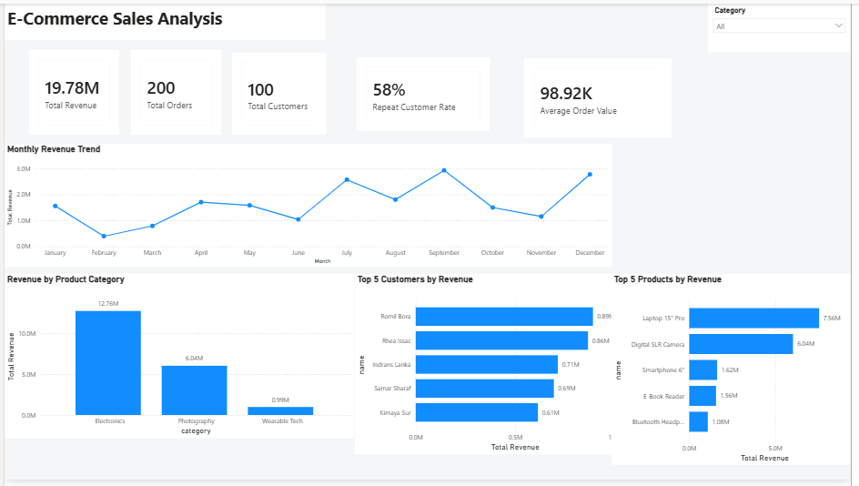

# E-Commerce Sales Analysis | SQL & Power BI

## Project Overview

This project analyzes an e-commerce business to understand sales performance, customer behavior, product performance, and revenue trends.

The analysis was performed using **MySQL** for data exploration and business-focused SQL analysis, followed by **Power BI** for interactive visualization and dashboarding.

The project focuses on translating business questions into measurable KPIs, SQL queries, and actionable insights.

---

## Business Context

The e-commerce company wants to better understand:

- Customer behavior and customer value
- Product and category performance
- Sales trends and revenue opportunities
- Demand signals that can support inventory planning

The objective is to use transactional data to identify revenue drivers, customer retention patterns, and areas requiring further investigation.

> **Note:** The dataset does not contain actual stock/inventory fields such as stock quantity, stockouts, or reorder levels. Therefore, inventory-related conclusions are limited to demand signals such as quantity sold and product/category performance rather than direct stock-level analysis.

---

## Dataset

The project uses four related tables:

### 1. Customers
Contains customer-level information.

| Column | Description |
|---|---|
| `customer_id` | Unique customer identifier |
| `name` | Customer name |
| `location` | Customer location |

### 2. Products
Contains product-level information.

| Column | Description |
|---|---|
| `product_id` | Unique product identifier |
| `name` | Product name |
| `category` | Product category |
| `price` | Listed product price |
| `quantity_purchased` | Product-level quantity field available in the source data |

### 3. Orders
Contains order-level information.

| Column | Description |
|---|---|
| `order_id` | Unique order identifier |
| `order_date` | Date of order |
| `customer_id` | Customer placing the order |
| `total_amount` | Order-level amount in source data |

### 4. Order Details
Contains line-item transaction information.

| Column | Description |
|---|---|
| `order_id` | Related order identifier |
| `product_id` | Related product identifier |
| `quantity` | Quantity purchased in the transaction |
| `price_per_unit` | Transaction-level selling price per unit |

---

## Data Model

The tables are connected through the following relationships:

```text
Customers (1) ────────< Orders (Many)
                           │
                           │ order_id
                           ▼
                    Order Details (Many)
                           ▲
                           │ product_id
                           │
                    Products (1)
```

The relationships allow customer, order, and product attributes to be combined for analysis in both SQL and Power BI.

---

## Tools & Technologies

- **MySQL** — database setup and SQL analysis
- **Power BI Desktop** — data modeling, DAX measures, and dashboard creation
- **SQL** — joins, aggregations, CTEs, CASE expressions, HAVING, window functions, conditional aggregation
- **DAX** — measures for revenue, orders, customers, repeat-customer rate, and AOV

---

## Business Questions & SQL Analysis

### Sales Optimization

1. What is the total revenue generated by the business?
2. How does revenue trend month over month?
3. What is the Average Order Value (AOV)?

### Customer Insights

4. Who are the top 5 customers by total revenue?
5. How many repeat customers have placed more than one order?
6. What are the revenue segments of customers based on their total revenue contribution?
7. How much revenue comes from Repeat Customers versus One-Time Customers?

### Product & Category Analysis

8. What is the total revenue generated by each product?
9. Which product categories generate the highest revenue?
10. How do product categories compare in terms of total revenue, quantity sold, and average selling price?
11. What is the weighted average selling price for each product category?
12. What percentage of total revenue is generated by the Top 5 products?

---

## Key SQL Techniques Used

- `JOIN` across related tables
- `GROUP BY` and aggregate functions
- `COUNT(DISTINCT ...)`
- `HAVING`
- `CASE`
- Common Table Expressions (`CTE`)
- `DENSE_RANK()` window function
- Conditional aggregation using `CASE`
- Date formatting with `DATE_FORMAT`
- Revenue and KPI calculations
- Weighted average selling price

---

## Power BI Dashboard

The Power BI dashboard provides an interactive executive view of the analysis, including:

- Total Revenue
- Total Orders
- Total Customers
- Repeat Customer Rate
- Average Order Value
- Monthly Revenue Trend
- Revenue by Product Category
- Top 5 Customers by Revenue
- Top 5 Products by Revenue
- Category slicer for interactive filtering



> The dashboard is designed as a concise business-facing summary, while the SQL analysis contains the deeper investigation behind the findings.

## Key Business Insights

### 1. Customer Retention & Revenue Contribution

Repeat customers account for **58% of the customer base but contribute 86.39% of total revenue**, indicating that returning customers are disproportionately valuable to the business. This suggests that customer retention and repeat-purchase strategies are important drivers of revenue and should remain a key focus for marketing efforts.

### 2. Category Performance & Pricing

Electronics is the largest revenue-generating category at approximately **12.758M**, followed by Photography at **6.04M** and Wearable Tech at **0.985M**.

Wearable Tech sold **249 units**, more than Photography's **151 units**, but generated substantially lower revenue. Its weighted average selling price was approximately **3,955.82**, compared with **40,000** for Photography. This suggests that Wearable Tech's lower revenue contribution is primarily associated with its lower revenue per unit rather than weak unit demand.

### 3. Product Revenue Concentration

The top five products generate approximately **17.86M**, representing **90.28% of total company revenue**. This indicates a high concentration of revenue among a small number of products and potential dependency on a limited product portfolio.

### 4. Monthly Revenue Variability

Monthly revenue shows noticeable variation across the year, with **September** representing the strongest month in the dataset and **February** among the weaker months. This indicates that revenue is not evenly distributed throughout the year and warrants further investigation into the drivers of peak and low-performing periods.

### 5. High-Value Customer Concentration

The top customers identified through the analysis are significant revenue contributors, with the highest-value customer generating approximately **0.91M**. This highlights the importance of identifying and retaining high-value customers while continuing to broaden the overall customer revenue base.

---

## Business Recommendations

### Customer Retention
Strengthen retention initiatives such as personalized offers, loyalty programs, and targeted remarketing campaigns, with particular focus on converting one-time customers into repeat buyers.

### Wearable Tech Pricing & Product Mix
Investigate pricing, product mix, and positioning within Wearable Tech to determine whether the category can increase revenue per unit without reducing its existing sales volume.

### Revenue Concentration
Ensure consistent availability of the highest-revenue products and monitor demand closely, while improving lower-performing products to gradually diversify the revenue base.

### Sales Planning
Investigate the drivers behind strong and weak months and align promotions, marketing activity, and demand planning with the observed sales pattern.

### High-Value Customers
Develop targeted retention strategies for high-value customers while monitoring customer concentration and opportunities to increase customer lifetime value.

---

## Project Structure

```text
Ecommerce_Analysis/
│
├── Dataset/
│   ├── customers.csv
│   ├── products.csv
│   ├── orders.csv
│   └── order_details.csv
│
├── SQL/
│   ├── ecommerce_setup.sql
│   └── ecommerce_analysis.sql
│
├── PowerBI/
│   └── Ecommerce_Analysis.pbix
│
├── Dashboard/
│   └── Ecommerce_Analysis_Dashboard.png
│
└── README.md
```

---

## Project Takeaway

This project demonstrates an end-to-end analytics workflow:

**Business Problem → SQL Data Analysis → KPI Development → Power BI Dashboard → Business Insights → Recommendations**

The analysis shows that customer retention, pricing, product concentration, and revenue seasonality are important areas for the business to investigate further.
